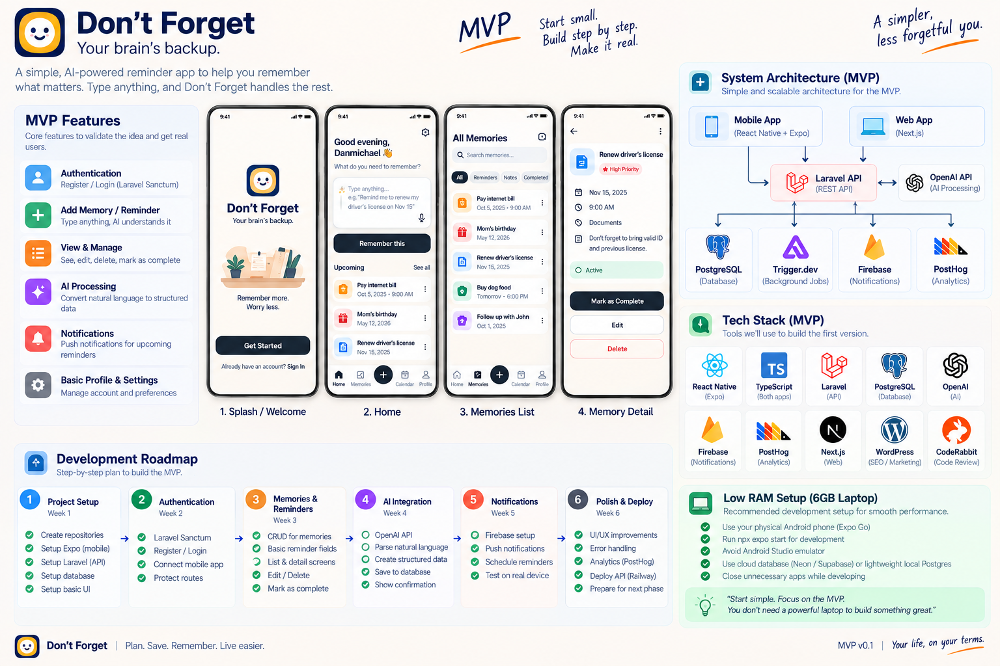
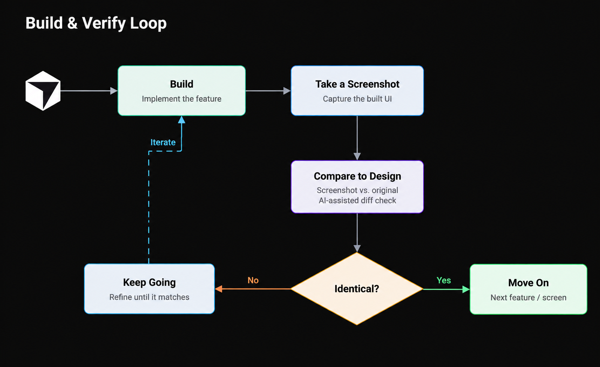

# Claude Code Starter

A reusable workflow for starting and building projects with Claude Code.

Every project gets the same disciplined process: docs first, strict rules, one approved task at a time. What changes per project is its architecture, stack and `AGENTS.md`.

```
New project idea
  → 1. Project documentation      (Claude Desktop)   → review & approve
  → 2. Project AGENTS.md          (Claude Desktop)   → review & approve
  → 3. Add the starter kit        (download + extract)
  → 4. Open in Claude Code        (read, inspect, confirm)
  → 5. Create the project skeleton  (part by part)
  → 6. Implement the design system   (ChatGPT image → Claude Code)
  → 7. Build UI with the verify loop
  → 8. Build one task at a time
```

**Two kinds of files:**

| | What it is | Changes per project? |
|---|---|---|
| `AGENTS.md` | This project's rules: stack, architecture, data model, security, checks | Yes, written fresh for each project |
| Starter kit (`templates/`) | The Claude Code workflow: commands, hooks, prompt template, review config | No, same kit every time |

---

## Step 1 — Create the project documentation

**Where:** Claude Desktop. **Output:** an MVP document. No code yet.

Attach your architecture image, screenshots or references, then use this prompt:

```text
Create a simple, developer-friendly MVP documentation for my app "[PROJECT NAME]" — [DESCRIPTION / TAGLINE].

Use the attached [ARCHITECTURE IMAGE / REFERENCE] as the reference.
Example



Include:
1. Product overview and MVP goal
2. Core MVP features
3. Tech stack and why each is used
4. System architecture diagram
5. Database overview ([MAIN ENTITIES])
6. Main user flow: [MAIN USER FLOW]
7. [ROADMAP / DEVELOPMENT PHASES]
8. Development setup and constraints: [HARDWARE / ENVIRONMENT / OTHER CONSTRAINTS]

Keep everything simple, practical, and straight to the point. Use Mermaid diagrams where appropriate.
Do not add unnecessary features or technologies. Do not write application code.
```

<details>
<summary>Example values (Don't Forget)</summary>

| Placeholder | Value |
|---|---|
| Project name | Don't Forget |
| Description | An AI-powered reminder/memory app ("Your brain's backup") |
| Main entities | users, memories, reminders |
| Main user flow | User → AI → Laravel API → PostgreSQL → Trigger.dev → Firebase |
| Roadmap | 6-week development roadmap |
| Constraints | 6GB RAM laptop, physical Android phone + Expo Go, avoid emulator |

Result: [`examples/dont-forget/MVP.md`](examples/dont-forget/MVP.md)
</details>

**Then:** review, correct, approve. Don't move on until the doc is right, because it becomes the source of truth.

---

## Step 2 — Create the project's AGENTS.md

**Where:** Claude Desktop. **Attach:** the approved MVP doc plus a reference AGENTS.md (for example [`examples/dont-forget/AGENTS.md`](examples/dont-forget/AGENTS.md)).

The reference only provides structure, tone and discipline. The approved doc provides the requirements.

```text
The project documentation is approved. I've attached it and a reference AGENTS.md.

Create a new AGENTS.md for this project.

Use the reference AGENTS.md ONLY as the structural and behavioral template. Keep its quality,
structure, workflow, writing style, strictness and engineering mindset.

Do NOT copy the reference project's architecture, stack, features, name, data model,
integrations or requirements. The approved documentation is the source of truth.

Include the sections this project needs, such as: what we are building, how to work, UI work,
skills to use, project structure, architecture boundaries, tech stack, decisions already made,
data model, integrations, security, background jobs, analytics, development/testing workflow,
checks to run, common pitfalls, what NOT to build, when in doubt.

Remove sections that don't apply. Add sections this project needs that the reference lacks.
Do not invent technologies, features or requirements. Keep it practical, strict and not
over-complicated.

Do not write application code. Output the complete AGENTS.md.
```

Add any hard rules from your planning that the doc doesn't state, for example "no Sanity in the MVP", "OpenAI calls stay server-side" or "user data is always scoped to the logged-in user".

**Then:** review, correct, approve.

> **Must include:** a **"Checks to run"** section with the exact commands for your stack. The kit's `/check` command runs those commands.

---

## Step 3 — Add the starter kit

1. Download [`claude-starter-kit.zip`](claude-starter-kit.zip).
2. Extract it into the **root of your new project folder**.
3. Put your approved `AGENTS.md` in the same root folder.
4. Add the lines from `.gitignore.claude` to your `.gitignore`, then delete `.gitignore.claude`.

Your project root should now look like this:

```
my-project/
├── AGENTS.md          ← yours, from Step 2
├── CLAUDE.md          ← from the kit
├── .claude/
├── prompts/
├── docs/
│   ├── decisions.md
│   └── design/        ← design system image goes here (Step 6)
└── .coderabbit.yaml
```

That's it. Nothing else to configure.

> Hidden files: `.claude/` and `.coderabbit.yaml` start with a dot. If you don't see them after extracting, turn on "show hidden files" (macOS Finder: `Cmd + Shift + .`; Windows Explorer: View → Show → Hidden items).

---

## Step 4 — Open the project in Claude Code

```bash
cd my-project
claude
```

First message:

```text
Read AGENTS.md and CLAUDE.md. Inspect the project folder and confirm my development environment.
Summarize the architecture, the rules you'll follow and the checks you'll run. Don't write code yet.
```

Correct anything Claude gets wrong before building. If you fix a rule, fix it in `AGENTS.md`, not only in chat.

---

## Step 5 — Create the project skeleton, part by part

Don't ask for the whole skeleton in one request. It's too much for one prompt, and one mistake spreads everywhere. Build it in small parts: **one `/plan` per part, one session per part**. Run `/check` and `/ship` after each part, then `/clear`.

| Part | Command | Done when |
|---|---|---|
| 5.1 Repo basics | `/plan set up the repo basics from AGENTS.md: folder structure, root .gitignore, README with how to run. No frameworks yet.` | Folders exist, first commit on GitHub |
| 5.2 First app | `/plan create the [mobile / web] app skeleton as described in AGENTS.md. Default starter screen only, no features.` | App runs (on your phone / in the browser) |
| 5.3 Backend | `/plan create the [API / backend] skeleton as described in AGENTS.md with a health check endpoint. No features.` | Health check responds |
| 5.4 Connect database | `/plan connect the backend to the database from AGENTS.md. Env example only, no tables yet.` | Backend connects to the database |
| 5.5 Connect app to backend | `/plan make the app call the health check endpoint and show the result.` | App shows "API OK" |
| 5.6 CI | `/plan add CI that runs the checks from AGENTS.md on every pull request.` | CI is green on a PR |

Then connect the repo to CodeRabbit.

**Skip or add parts to fit your stack.** A project without a backend skips 5.3–5.5; a project with background jobs adds "5.x Jobs skeleton" after 5.4. Services like OpenAI, Trigger.dev or Firebase are set up later, in the task that first needs them, not in the skeleton.

<details>
<summary>Example (Don't Forget)</summary>

1. Repo basics: `mobile/`, `api/`, `jobs/`, `docs/`, `prompts/`
2. Expo app: runs in Expo Go on the phone
3. Laravel API: `GET /api/health`
4. Cloud PostgreSQL: Laravel connects to Neon / Supabase
5. Phone → API: app shows "API OK" using the laptop's LAN IP
6. CI: API tests + Pint, mobile `tsc` + lint

Trigger.dev, Firebase and OpenAI wait for their own tasks (notifications, AI parsing).
</details>

**Rules for every part:**

- One part = one prompt file = one branch = one PR. Don't start the next part until the current one runs.
- No features in the skeleton. It only proves that each piece starts and that the pieces can talk to each other.
- No technology gets added just because Claude suggests it. `AGENTS.md` sets the boundaries.

---

## Step 6 — Implement the design system

**Where:** ChatGPT (image), then Claude Code (implementation). **Output:** theme tokens and base components that every screen uses.

Do this before building any screen. If screens come first, each one invents its own colors and spacing, and you end up fixing them one by one.

**6.1 Generate the design system image in ChatGPT**

```text
Create a design system sheet for my app "[PROJECT NAME]" — [DESCRIPTION].
Style: [e.g. friendly, clean, rounded, warm yellow accent]. Platform: [mobile app / web app].

Show on one sheet, with exact values written next to each item:
- Color palette: primary, secondary, background, surface, text, muted text, border,
  success, warning, error (hex codes)
- Typography: font family, and sizes/weights for H1, H2, H3, body, small, caption
- Spacing scale (e.g. 4, 8, 12, 16, 24, 32)
- Border radius and shadow levels
- Components with states: primary/secondary/destructive buttons, text input, card,
  list item, chip/badge, tab bar, empty state
- Icon style

Label every value clearly so a developer can copy it into code.
```

Iterate until you're happy with it, then save the image.

**6.2 Add it to the project**

Save it as `docs/design/design-system.png`. Put any screen references (mockups) in `docs/design/` too, for example `docs/design/home.png`.

**6.3 Implement it in Claude Code**

```text
/plan implement the design system from docs/design/design-system.png
```

Attach the image as well. The prompt Claude writes should cover:

- **Tokens:** colors, typography, spacing, radius and shadows in one theme file. No hardcoded values in screens.
- **Base components:** only the ones shown on the sheet (buttons, input, card, list item, chip, and so on), with all states.
- **A preview screen or page** that renders every token and component, so you can check it against the image.
- **Values it can't read exactly** from the image (a blurry hex code, an unclear font) listed in the prompt for you to confirm. No guessing.

Approve the prompt, let Claude build it, then run `/verify-ui design system preview` to compare the preview with the image.

**Then:** add a line to `docs/decisions.md`, for example `Design system v1 approved — docs/design/design-system.png`. From now on, every screen uses these tokens and components.

---

## Step 7 — Build UI with the verify loop

When a task has a visual reference (screenshot, Figma export, image), the reference is the source of truth.



```
Reference → Build → Screenshot → Compare → Matches?
                         ↑                    │
                         └────── Fix ← No ────┘   Yes → next screen
```

Screens are built from the Step 6 tokens and components. The loop is already written into the kit's `CLAUDE.md`, so your prompt stays short:

```text
/plan implement the home screen
```

Attach the reference image. If Claude skips the loop, run:

```text
/verify-ui home screen
```

Don't move on to the next screen until the current one passes.

---

## Step 8 — Build one task at a time

```
/plan <task> → approve → Claude builds → /check → /verify-ui (UI only) → /ship → review PR → merge → /clear
```

| Command | What it does |
|---|---|
| `/plan <task>` | Reads the rules and code, writes `prompts/NN-name.md`, asks Yes/No. No code. |
| `/check` | Runs the "Checks to run" from `AGENTS.md` for what changed and reports real results |
| `/verify-ui` | Screenshot → compare → fix loop against the reference |
| `/ship` | Branch, commit, push, open a PR (needs the GitHub CLI, `gh`) |
| `/clear` | Built into Claude Code. Start fresh for the next task. |

Example task order (Don't Forget):

1. Authentication screens
2. Authentication API
3. Connect mobile auth to the API
4. Memories database model
5. Memory list screen
6. Natural-language memory creation

**Habits that keep this working:**

- **One task = one prompt file = one branch = one PR = one fresh session.** Never ask for the whole app in one request.
- **Log decisions.** When you settle something, add one line to `docs/decisions.md` so Claude stops reopening it.
- **Fix the rule, not just the output.** If Claude keeps making the same mistake, add a line to `AGENTS.md`.

---

## Updating the starter kit

`templates/` is the source. After editing it, rebuild the zip from inside the folder so the files extract straight into a project root:

```bash
cd templates
zip -r ../claude-starter-kit.zip . -x "*.DS_Store"
```

Keep the kit generic. Anything specific to one project belongs in that project's `AGENTS.md`.