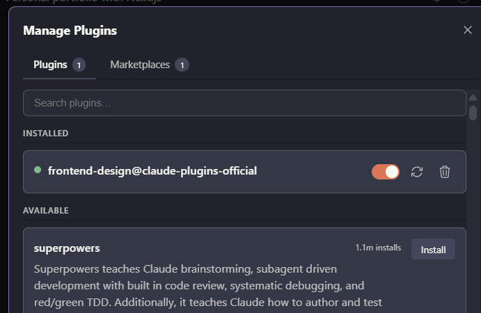
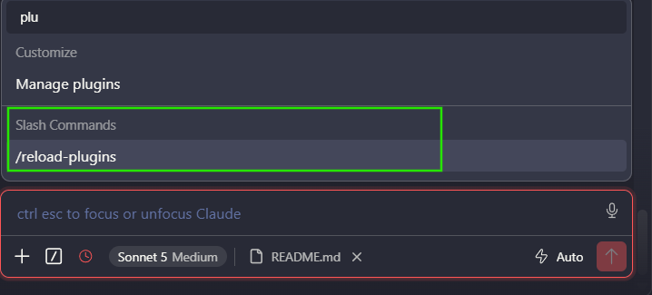

# Frontend Design

Official Anthropic Claude Code Skill for creating distinctive,
production-grade frontend interfaces.

The Skill helps Claude improve frontend work through better decisions around:

- Layout
- Typography
- Color
- Spacing
- Visual hierarchy
- Responsive design
- Animation
- Interaction
- Accessibility

It is useful for portfolios, SaaS applications, landing pages, dashboards,
React, Next.js, and other frontend projects.

---

# Official Source

Official Claude Code repository:

https://github.com/anthropics/claude-code

Official `frontend-design` plugin:

https://github.com/anthropics/claude-code/tree/main/plugins/frontend-design

Official Skill:

https://github.com/anthropics/claude-code/blob/main/plugins/frontend-design/skills/frontend-design/SKILL.md

Always prefer the official Anthropic version.

---

# Installation

The recommended way to install `frontend-design` is through Claude Code's
official plugin system.

---

## Step 1 — Open Your Project

Open Claude Code from the root of your project:

```powershell
cd my-project
claude
```

---

## Step 2 — Open Plugin Management

Inside Claude Code, type:

```text
/plug
```

Then select:

```text
Manage plugins
```

---

## Step 3 — Find Frontend Design

Search for:

```text
frontend-design
```

Select the official Anthropic version.



---

## Step 4 — Install the Plugin

Install the `frontend-design` plugin.

If Claude Code provides a scope option, use:

```text
Project
```

when you want the Skill associated with the current project.

---

## Step 5 — Reload Plugins

After installation, reload the plugins:

```text
/reload-plugins
```



The `frontend-design` Skill should now be available.

---

# Verify the Skill

Before using it for development, ask Claude to verify that it is available.

Use:

```text
Before changing anything, inspect this project.

Tell me whether the frontend-design Skill is available.

Also tell me:
1. What Skill you detected.
2. Where it comes from.
3. What kind of frontend work it can help with.

Do not modify any files.
```

---

# How to Use Frontend Design

Installing the Skill does not mean you need to type a special command every
time.

The Skill provides Claude with specialized frontend design guidance.

You use it naturally through your prompts.

The quality of the result still depends on how clearly you describe the task,
context, constraints, and desired outcome.

---

# Basic Prompt

For a simple frontend task:

```text
Use the frontend-design Skill for this task.

I want to redesign the homepage hero.

Before writing code:

1. Inspect the existing project.
2. Analyze the current hero.
3. Identify the main design problems.
4. Propose a stronger visual direction.
5. Explain the typography, spacing, color, and layout decisions.
6. Give me a concise implementation plan.

Do not modify files yet.

Wait for my approval.
```

This tells Claude explicitly that the task should use the frontend-design
capabilities.

---

# Better Prompt

For higher-quality results, provide more context.

```text
Use the frontend-design Skill for this task.

I am building a personal developer portfolio with Next.js.

The visual direction should feel:

- Premium
- Minimal
- Editorial
- Modern
- Technical
- Distinctive

I do not want a generic SaaS design or typical AI-generated purple gradient
interface.

Before writing code:

1. Inspect the current project.
2. Inspect the existing UI.
3. Analyze the current visual hierarchy.
4. Propose a visual direction.
5. Recommend typography.
6. Recommend a color system.
7. Recommend spacing and layout.
8. Recommend meaningful interactions or animation.
9. Explain your reasoning.
10. Create a concise implementation plan.

Do not modify files yet.

Wait for my approval.
```

---

# Using It With a Screenshot

You can provide Claude with a screenshot or visual reference.

Example:

```text
Use the frontend-design Skill to analyze this design reference.

Do not copy it directly.

Analyze:

- Layout
- Typography
- Color
- Spacing
- Visual hierarchy
- Components
- Interaction
- Animation
- Responsive behavior

Then propose how we could create a similar visual quality while making the
design original to this project.

Do not write code yet.
```

This is useful when working from:

- Figma designs
- Website references
- Screenshots
- Portfolio inspiration
- UI concepts

---

# Using It With Figma

When you have a Figma design:

```text
Use the frontend-design Skill to help translate this Figma design into the
existing project.

First inspect the project.

Then analyze:

1. Layout structure
2. Typography
3. Colors
4. Spacing
5. Components
6. Responsive behavior
7. Interactions

Explain how the Figma design should map to the existing architecture.

Do not implement yet.
```

---

# Using It for a New Section

For example, a Projects section:

```text
Use the frontend-design Skill.

I want to create a Projects section for my portfolio.

Before coding:

- Analyze the purpose of the section.
- Recommend the visual hierarchy.
- Recommend the card structure.
- Recommend typography.
- Recommend spacing.
- Recommend image treatment.
- Recommend hover interactions.
- Recommend responsive behavior.

The design should feel premium and distinctive without becoming
over-designed.

Do not modify files yet.

Wait for my approval.
```

---

# Using It for an Existing Section

If the UI already exists:

```text
Use the frontend-design Skill to critique the existing Projects section.

Do not change anything yet.

Analyze:

- Visual hierarchy
- Typography
- Spacing
- Color
- Card composition
- Alignment
- Responsive behavior
- Hover states
- Animation
- Accessibility
- Generic design patterns

Give me the five highest-priority improvements.
```

---

# Using It for Visual Critique

One of the most useful ways to use the Skill is to ask Claude to critique
the interface before making changes.

```text
Use the frontend-design Skill as a senior product designer.

Critique the current page.

Focus on:

1. Visual hierarchy
2. Typography
3. Spacing
4. Composition
5. Color
6. Responsive behavior
7. Interaction
8. Accessibility
9. Brand identity
10. Generic AI-generated design patterns

Do not modify files.

Rank the problems from highest to lowest priority.
```

---

# Using It During Implementation

After approving the design direction:

```text
Implement the approved design.

Use the frontend-design Skill.

Only modify the files required for this section.

Do not redesign unrelated components.

Keep the architecture simple.

Preserve existing functionality.

Make the implementation responsive and accessible.

After implementation, explain:

1. What changed.
2. Which files changed.
3. Why the changes were made.
4. What I should review.
```

---

# Using It for Refinement

After seeing the implementation:

```text
Use the frontend-design Skill to review the implementation we just created.

Compare the result against the approved design direction.

Identify:

- Visual inconsistencies
- Weak hierarchy
- Poor spacing
- Typography problems
- Unnecessary decoration
- Weak responsive behavior
- Unnecessary animation
- Accessibility issues

Do not modify files yet.

Give me the highest-priority refinements.
```

Then:

```text
Apply only the approved refinements.

Do not make unrelated changes.
```

---

# Recommended Workflow

Use the Skill as part of a development loop:

```text
Inspect
   ↓
Analyze
   ↓
Design Direction
   ↓
Plan
   ↓
Review
   ↓
Implement
   ↓
Test
   ↓
Critique
   ↓
Refine
```

This is better than:

```text
Prompt
   ↓
Generate Everything
```

---

# Important Prompting Principle

Do not rely on:

```text
Make it beautiful.
```

Instead, explain:

```text
What am I building?
Who is it for?
What should it feel like?
What should it avoid?
What constraints exist?
What should Claude do first?
```

For example:

```text
Build a developer portfolio.

Feel:
Premium, technical, editorial, minimal.

Avoid:
Generic SaaS layouts, excessive gradients, excessive rounded cards,
and unnecessary animation.

Priority:
Typography, composition, project presentation, and responsive behavior.

Workflow:
Inspect → propose → wait for approval → implement → review.
```

The more useful context Claude receives, the more useful the design decisions
can become.

---

# Frontend Design + CLAUDE.md

The Skill and `CLAUDE.md` have different responsibilities.

## `frontend-design`

Provides specialized frontend design knowledge.

```text
frontend-design
      ↓
Typography
Layout
Color
Motion
Responsive design
Accessibility
Visual direction
```

## `CLAUDE.md`

Defines project-specific rules.

```text
CLAUDE.md
      ↓
Architecture
Framework
Coding conventions
Component rules
File organization
Development workflow
```

Together:

```text
Claude Code
     │
     ├── CLAUDE.md
     │      └── Project rules
     │
     └── frontend-design
            └── Frontend design expertise
```

---

# Example Next.js Project

A project using the Skill might look like:

```text
my-project/
│
├── .claude/
│
├── CLAUDE.md
│
├── app/
│   ├── layout.tsx
│   ├── page.tsx
│   └── globals.css
│
├── components/
│   ├── Navbar.tsx
│   ├── Hero.tsx
│   └── Projects.tsx
│
├── public/
│   └── images/
│
└── package.json
```

The exact `.claude` structure depends on how the Skill was installed.

---

# Screenshot Documentation

This README only uses two screenshots.

```text
frontend-design/
│
├── README.md
│
└── images/
    ├── frontend-design-plugin.png
    └── reload-plugins.png
```

The images are referenced using relative Markdown paths.

Example:

```markdown

```

and:

```markdown

```

Do not use local computer paths.

Incorrect:

```text
C:\Users\...\Pictures\Screenshot.png
```

Correct:

```text
./images/frontend-design-plugin.png
```

---

# Troubleshooting

## Plugin Management Is Unavailable

Check your Claude Code version:

```powershell
claude --version
```

Check plugin support:

```powershell
claude plugin --help
```

If the plugin system is unavailable, use the manual Skill installation
method from the official Skill source.

---

## Claude Does Not Detect the Skill

Restart Claude Code:

```powershell
claude
```

Then ask:

```text
Is the frontend-design Skill available in this project?

Do not modify any files.
```

---

## Claude Makes Too Many Changes

Use bounded instructions:

```text
Inspect first.

Do not modify anything yet.

Explain what you would change.

Wait for my approval.
```

Then implement only the approved section.

---

# Design Checklist

Before considering a frontend section finished:

```text
[ ] Clear visual direction
[ ] Strong hierarchy
[ ] Intentional typography
[ ] Consistent spacing
[ ] Clear color system
[ ] Responsive layout
[ ] Accessible interactions
[ ] Meaningful animation
[ ] No unnecessary decoration
[ ] No generic AI-looking patterns
```

---

# Quick Reference

### Open Plugin Management

```text
/plug
```

### Manage Plugins

```text
Manage plugins
```

### Search

```text
frontend-design
```

### Reload

```text
/reload-plugins
```

### Verify

```text
Tell me whether the frontend-design Skill is available.

Do not modify any files.
```

### Start a Design Task

```text
Use the frontend-design Skill for this task.

First inspect the project.

Then analyze the current UI and propose a design direction.

Do not modify files yet.
```

### Implement After Approval

```text
Implement only the approved design.

Do not modify unrelated files.

Keep the architecture simple.

Make it responsive and accessible.
```

---

# Official References

Claude Code:

https://code.claude.com/

Claude Code Plugin Documentation:

https://code.claude.com/docs/en/discover-plugins

Official Claude Code Repository:

https://github.com/anthropics/claude-code

Official Frontend Design Plugin:

https://github.com/anthropics/claude-code/tree/main/plugins/frontend-design

Official Frontend Design Skill:

https://github.com/anthropics/claude-code/blob/main/plugins/frontend-design/skills/frontend-design/SKILL.md