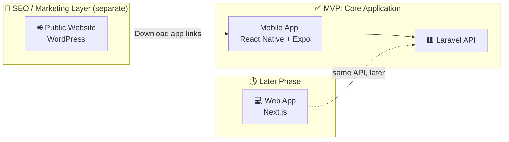
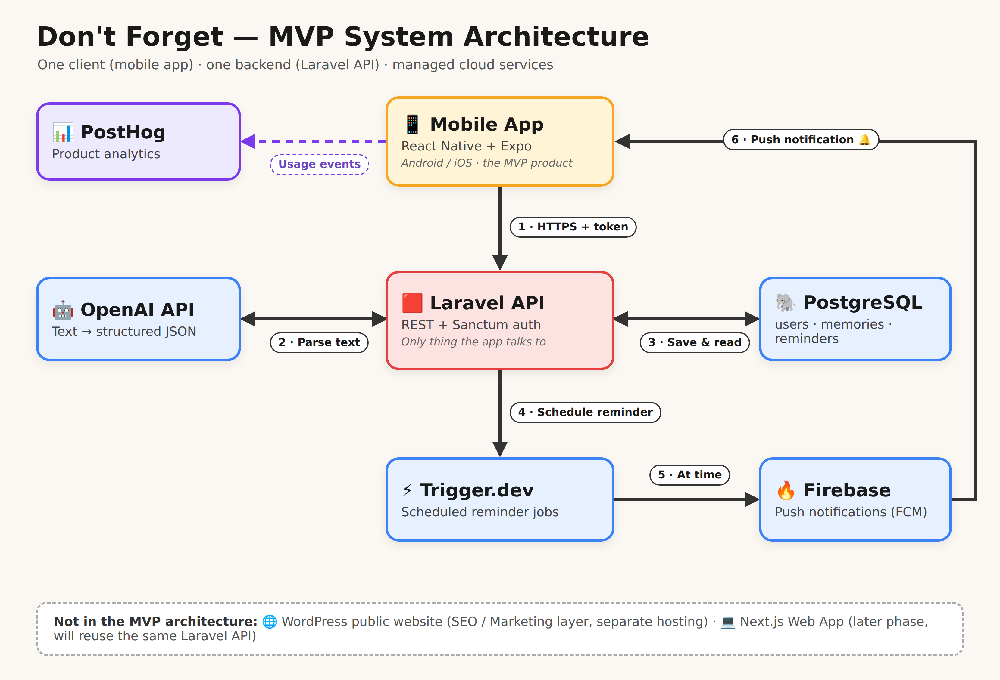
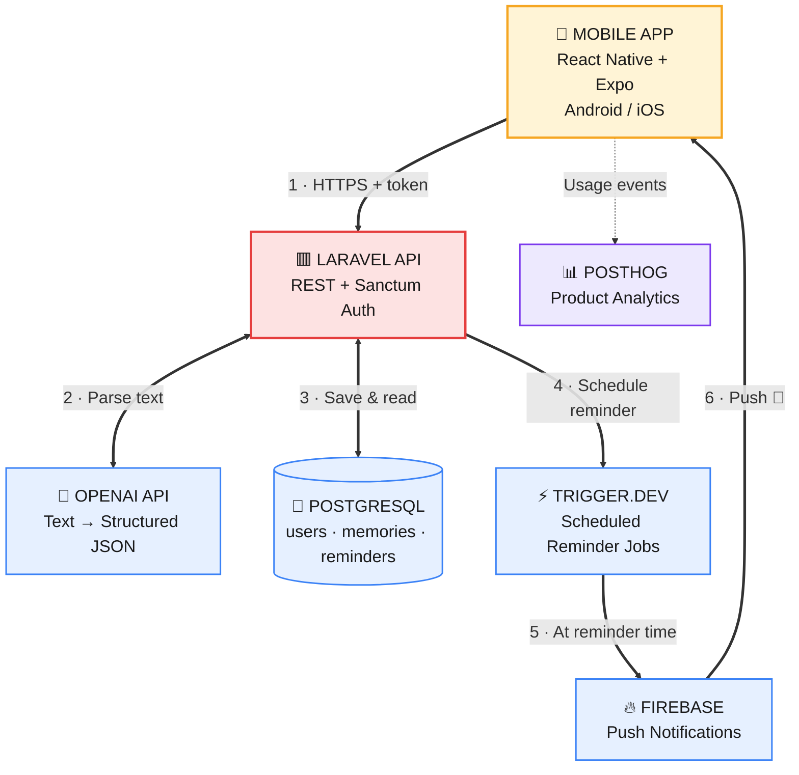
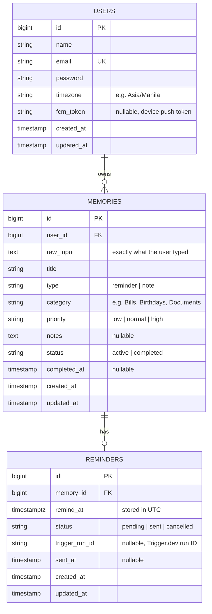
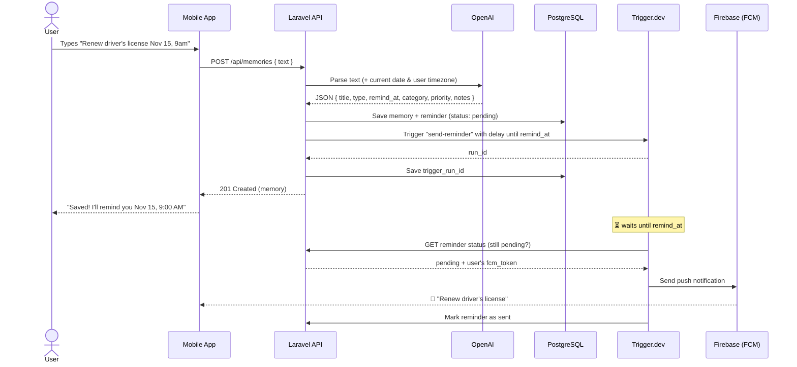
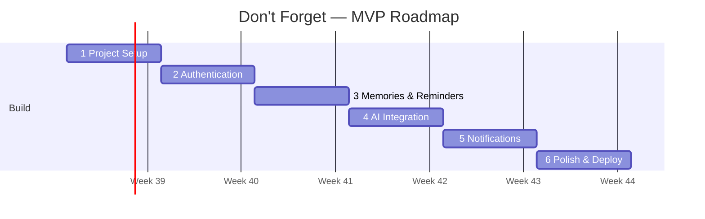
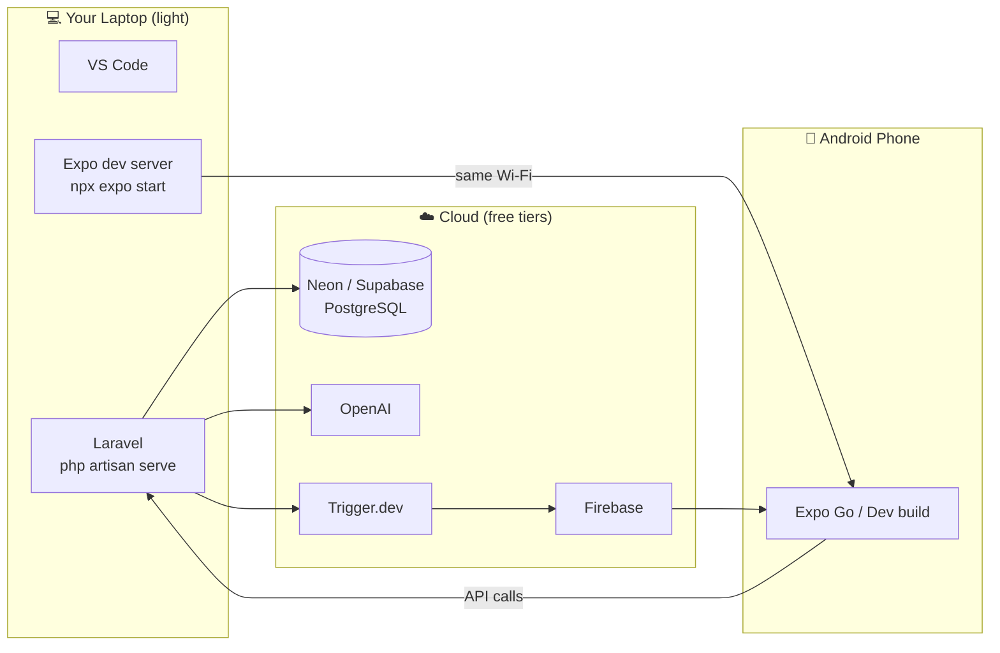

# Don't Forget — MVP Documentation

> **Your brain's backup.** Type anything, and Don't Forget handles the rest.

**Version:** MVP v0.1 · **Timeline:** 6 weeks · **Principle:** Start small. Build step by step. Make it real.

---

## 1. Product Overview

**Don't Forget** is an AI-powered reminder and memory app. The user types (or dictates) a thought in plain language, for example:

> "Remind me to renew my driver's license on Nov 15, don't forget valid ID"

The AI turns it into a structured memory with a title, date, time, category and notes, and the app sends a push notification at the right time.

### MVP Goal

Validate one core idea with real users:

> **Can people save and get reminded of things faster by typing naturally instead of filling out forms?**

The MVP is a success when a user can:

1. Sign up and log in
2. Type a reminder in plain language
3. See it saved correctly (title, date, time)
4. Receive a push notification on time
5. Mark it as complete

Everything else waits until after the MVP.

### Product Layers

Don't Forget has **3 separate layers**. Only the first one is the MVP.

| Layer | Tech | Purpose | Status |
|-------|------|---------|--------|
| **1. Mobile App** | React Native + Expo | The main product for Android and iOS | ✅ **MVP: build first** |
| **2. Public Website** | WordPress | SEO, blog, guides, landing pages, FAQ, free tools; brings in organic traffic | 📣 **Marketing only**, not part of the app |
| **3. Web App** | Next.js | Logged-in browser version: dashboard, memories, reminders, calendar, settings | 🕒 **Later phase**, not in the MVP |



- The **WordPress site does not connect to the Laravel API or the database.** It only links people to the app.
- The **Next.js Web App will reuse the same Laravel API** when it's built. No backend changes are needed for it.

---

## 2. Core MVP Features

| # | Feature | What it does |
|---|---------|--------------|
| 1 | **Authentication** | Register, log in, log out (Laravel Sanctum tokens) |
| 2 | **Add Memory / Reminder** | One text box; the user types anything |
| 3 | **AI Processing** | Converts natural language into structured data (title, date, category, priority, notes) |
| 4 | **View & Manage** | List, search, filter (All / Reminders / Notes / Completed), edit, delete, mark complete |
| 5 | **Notifications** | Push notification at the reminder time |
| 6 | **Basic Profile & Settings** | Name, email, timezone, logout |

### App Screens

1. **Splash / Welcome** — Get Started / Sign In
2. **Home** — Greeting, "What do you need to remember?" input, upcoming list
3. **Memories List** — Search, filter chips, all memories
4. **Memory Detail** — Date, time, category, notes, status, Mark as Complete / Edit / Delete

### Not in the MVP

Recurring reminders, sharing, attachments, calendar sync, offline mode, voice-first UI, and team features.

---

## 3. Tech Stack

### MVP stack

| Layer | Tool | Why |
|-------|------|-----|
| Mobile app | **React Native + Expo** | One codebase for Android and iOS; test instantly on a real phone (no emulator needed) |
| Language | **TypeScript** | Catches bugs early in the mobile app and Trigger.dev tasks |
| Backend API | **Laravel** (REST) | Fast to build CRUD, auth, validation and migrations |
| Auth | **Laravel Sanctum** | Simple token auth for mobile apps |
| Database | **PostgreSQL** (Neon or Supabase) | Reliable relational DB; cloud-hosted means nothing heavy runs on your laptop |
| AI | **OpenAI API** | Turns natural language into structured JSON |
| Background jobs | **Trigger.dev** | Schedules delayed jobs ("send at Nov 15, 9:00 AM") without running your own queue worker or cron server |
| Notifications | **Firebase Cloud Messaging** | Free, standard push notifications for Android (and iOS later) |
| Analytics | **PostHog** | See whether people actually use it (sign-ups, memories created, completions) |
| Hosting (API) | **Railway** | Easy Laravel deploy from GitHub |

### Outside the MVP app

| Tool | Layer | Notes |
|------|-------|-------|
| **WordPress** | SEO / Marketing | Public website on separate hosting; no connection to the app backend |
| **Next.js** | Web App (later phase) | Logged-in browser version; reuses the same Laravel API |
| **CodeRabbit** | Dev tooling | Automated code review on pull requests (optional) |

---

## 4. System Architecture (MVP)

The MVP has **one client (the mobile app)** and **one backend (the Laravel API)**. WordPress and the Next.js Web App are **not** part of this diagram.



*High-resolution image: `dont-forget-architecture.png`. Mermaid source below for GitHub / VS Code.*



| Component | Role |
|-----------|------|
| **Mobile App** | Everything the user sees and does |
| **Laravel API** | Auth, validation, business logic; the only thing the app talks to |
| **OpenAI API** | Turns "Pay internet bill Oct 5 at 9am" into structured data |
| **PostgreSQL** | Stores users, memories and reminders |
| **Trigger.dev** | Waits until the reminder time, then runs the send job |
| **Firebase** | Delivers the push notification to the phone |
| **PostHog** | Tracks sign-ups, memories created, completions |

### Key rules

- **The mobile app only talks to the Laravel API.** It never calls OpenAI or the database directly.
- **The OpenAI API key stays on the server**, never in the mobile app.
- **Laravel is the source of truth.** Trigger.dev only runs the timer and sends the push.

---

## 5. Database Overview

Three core tables. Sanctum adds its own `personal_access_tokens` table automatically.



### Notes

- **One memory → zero or one reminder.** A note has no reminder; a reminder has exactly one.
- **Store `remind_at` in UTC** and convert using `users.timezone` for display. This prevents "wrong hour" bugs.
- **Keep `raw_input`** so you can re-run the AI later or debug bad parses.
- **Indexes:** `memories(user_id, status)` and `reminders(status, remind_at)`.

---

## 6. Main User Flow

**User → AI → Laravel API → PostgreSQL → Trigger.dev → Firebase**

In practice, the text goes through Laravel first so the AI key stays on the server:



### Step by step

1. **User types** anything into the input box.
2. **Laravel sends the text to OpenAI** with the current date/time and the user's timezone, so "tomorrow 6pm" resolves correctly.
3. **OpenAI returns structured JSON.** Use Structured Outputs (a JSON schema) so the response is always valid. Use a small, low-cost model.
4. **Laravel validates and saves** the memory and reminder to PostgreSQL.
5. **Laravel schedules a Trigger.dev task** with a delay until `remind_at` and stores the returned `trigger_run_id`.
6. **At the right time**, the Trigger.dev task checks the reminder is still `pending`, then sends the push through Firebase.
7. **The task marks the reminder as `sent`.**

### Edit, delete and complete

- **Edit time:** cancel the old Trigger.dev run → schedule a new one → save the new `trigger_run_id`.
- **Delete / Mark complete:** cancel the run and set the reminder to `cancelled`.
- The status check in step 6 is a safety net if a cancel ever fails.

### AI output shape

```json
{
  "title": "Renew driver's license",
  "type": "reminder",
  "remind_at": "2026-11-15T09:00:00+08:00",
  "category": "Documents",
  "priority": "high",
  "notes": "Bring valid ID and previous license."
}
```

If the AI can't find a date, save the memory as a `note` with no reminder.

### API Endpoints

| Method | Endpoint | Purpose |
|--------|----------|---------|
| POST | `/api/register` | Create account |
| POST | `/api/login` | Get token |
| POST | `/api/logout` | Revoke token |
| GET | `/api/me` | Current user |
| PATCH | `/api/me` | Update name, timezone, `fcm_token` |
| GET | `/api/memories?filter=&search=` | List memories |
| POST | `/api/memories` | Create from plain text (AI) |
| GET | `/api/memories/{id}` | Memory detail |
| PATCH | `/api/memories/{id}` | Edit |
| DELETE | `/api/memories/{id}` | Delete |
| POST | `/api/memories/{id}/complete` | Mark as complete |
| GET | `/api/internal/reminders/{id}` | Trigger.dev checks status (secret key) |
| POST | `/api/internal/reminders/{id}/sent` | Trigger.dev marks sent (secret key) |

Protect `/api/internal/*` with a shared secret header, not a user token.

---

## 7. 6-Week Development Roadmap



| Week | Focus | Tasks | Done when… |
|------|-------|-------|------------|
| **1** | Project Setup | Create repos · Set up Expo (mobile) · Set up Laravel (API) · Set up cloud Postgres · Basic UI shell and navigation | App opens on your phone and calls a `/api/health` endpoint |
| **2** | Authentication | Laravel Sanctum · Register / Login screens · Store token securely (`expo-secure-store`) · Protect routes | You can sign up, log in, log out |
| **3** | Memories & Reminders | Migrations · CRUD endpoints · Basic reminder fields · Home, List and Detail screens · Edit / Delete · Mark complete | You can manually create and manage memories |
| **4** | AI Integration | OpenAI API · Parse natural language · Structured JSON output · Save to database · Show confirmation | Typing plain text creates a correct memory |
| **5** | Notifications | Firebase setup · Push tokens · Trigger.dev scheduled task · Cancel/reschedule on edit · Test on real device | A reminder arrives on your phone on time |
| **6** | Polish & Deploy | UI/UX fixes · Error handling · PostHog events · Deploy API to Railway · Prepare for next phase | 5–10 real users are testing it |

**Scope:** These 6 weeks are mobile app + Laravel API only. The WordPress site can be built separately at any time (it doesn't depend on the app). The Next.js Web App starts after the MVP and reuses the same API.

### PostHog events to track

`user_signed_up`, `memory_created`, `ai_parse_failed`, `reminder_delivered`, `memory_completed`

---

## 8. Development Setup (6GB RAM Laptop)

**Rule:** Run as little as possible locally. Use your phone and the cloud for the heavy parts.

### What runs where



### Do

- ✅ **Use your physical Android phone** with **Expo Go** for daily development
- ✅ **Use a cloud database** (Neon or Supabase) instead of local Postgres
- ✅ **Use VS Code** as your only editor
- ✅ **Close unnecessary apps** while developing, especially extra browser tabs

### Avoid

- ❌ Android Studio emulator (uses 2–4 GB RAM alone)
- ❌ Docker / Laravel Sail
- ❌ Running WordPress locally while building the app (use a hosted WordPress instead)

### Folder structure

```
dont-forget/
├── mobile/   # React Native + Expo (TypeScript)
├── api/      # Laravel
├── jobs/     # Trigger.dev tasks (TypeScript)
└── web/      # Next.js Web App (later phase, not in the MVP)

# WordPress (SEO/Marketing) lives in its own hosting, not in this repo
```

### Daily workflow

**1. Start the API** so your phone can reach it over Wi-Fi:

```bash
cd api
php artisan serve --host=0.0.0.0 --port=8000
```

**2. Point the app at your laptop's local IP** in `mobile/.env`:

```bash
EXPO_PUBLIC_API_URL=http://192.168.1.10:8000/api
```

Find your IP with `ipconfig` (Windows) or `ip addr` (Linux/macOS).

**3. Start Expo and scan the QR code** with Expo Go:

```bash
cd mobile
npx expo start
```

If your Wi-Fi blocks device-to-device traffic, use `npx expo start --tunnel`.

**4. Only when working on notifications (Week 5):**

```bash
cd jobs
npx trigger.dev@latest dev
```

### Important: push notifications and Expo Go

Remote push notifications **no longer work inside Expo Go on Android** (since Expo SDK 53). For Week 5:

1. Build a **development build** in the cloud with EAS: `eas build --profile development --platform android`
2. Install the APK on your phone
3. Keep using `npx expo start` exactly as before

The build runs on Expo's servers, so you still don't need Android Studio.

### Environment variables

| App | Variables |
|-----|-----------|
| `api/.env` | `DB_CONNECTION=pgsql`, `DB_URL`, `OPENAI_API_KEY`, `TRIGGER_SECRET_KEY`, `INTERNAL_API_SECRET` |
| `jobs/.env` | `TRIGGER_SECRET_KEY`, `API_BASE_URL`, `INTERNAL_API_SECRET`, `FIREBASE_SERVICE_ACCOUNT` |
| `mobile/.env` | `EXPO_PUBLIC_API_URL`, `EXPO_PUBLIC_POSTHOG_KEY` |

Never commit `.env` files. Never put `OPENAI_API_KEY` or the Firebase service account in the mobile app.

---

> *"Start simple. Focus on the MVP. You don't need a powerful laptop to build something great."*

**Don't Forget** · Plan. Save. Remember. Live easier.
